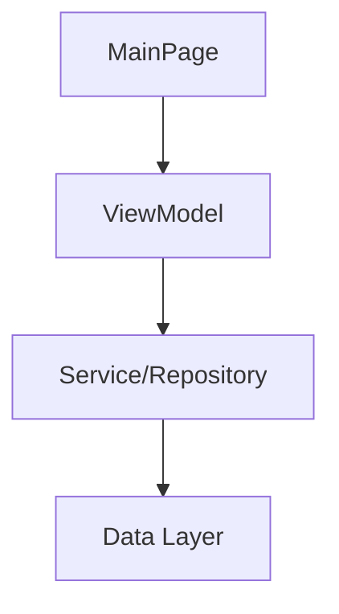

# Design: {name}

> Part of [{name}](README.md)

## Goals & Non-Goals

### Goals
<!-- What MUST be built? Be explicit and measurable. -->
-

### Non-Goals
<!-- What will NOT be built? This prevents scope creep and "hallucinated" features. -->
-

## Visual Architecture

<!-- Use Mermaid diagrams to define component hierarchy and relationships -->



### Component Hierarchy

<!-- Explicit MVVM/MVC structure for .NET MAUI -->

**Pages/Views**:
-

**ViewModels**:
-

**Services/Repositories**:
-

**Models/Entities**:
-

## Interface & Method Signatures

<!-- Define ALL public interfaces and key method signatures BEFORE implementation -->
<!-- This ensures type consistency and prevents "guessing" by the AI agent -->

### Interface: IExampleService

```csharp
public interface IExampleService
{
    /// <summary>
    /// Retrieves items with pagination support
    /// </summary>
    /// <param name="offset">Starting position (0-based)</param>
    /// <param name="limit">Maximum number of items to return</param>
    /// <returns>Collection of items</returns>
    Task<IEnumerable<Item>> GetItemsAsync(int offset, int limit);
}
```

### Class: ExampleViewModel

```csharp
public class ExampleViewModel : ReactiveObject
{
    // Observable properties
    [Reactive] public string SearchText { get; set; }

    // Commands
    public ReactiveCommand<Unit, Unit> SubmitCommand { get; }

    // Constructor signature
    public ExampleViewModel(IExampleService service, IMessageBus messageBus);
}
```

## Plain English Test Scenarios

<!-- These will become the "Red" phase test cases. Write them as user stories/behaviors. -->

### Scenario: User submits empty form
- **Given**: The form is displayed
- **When**: User clicks "Submit" with an empty required field
- **Then**: An error message appears and form is not submitted

### Scenario: Successful data load
- **Given**: The service returns 5 items
- **When**: The ViewModel initializes
- **Then**: The Items collection contains 5 elements

### Scenario: Navigation on item selection
- **Given**: A list of items is displayed
- **When**: User taps an item
- **Then**: Navigation occurs to the detail page with the selected item

## Technical Approach

<!-- Specific technologies, patterns, frameworks -->

**Framework**: .NET MAUI (net10.0-windows10.0.19041.0)

**Patterns**:
- MVVM with ReactiveUI
- Repository pattern for data access
- Dependency Injection (Microsoft.Extensions.DependencyInjection)

**Key Libraries**:
- ReactiveUI (v{version})
- SkiaSharp (if applicable)
- CommunityToolkit.Maui

## Design Decisions

<!-- Key decisions and rationale -->

### Decision 1: Use ReactiveUI over plain INotifyPropertyChanged

**Context**: Need observable properties for data binding in MAUI

**Decision**: Use ReactiveUI's `ReactiveObject` base class and `[Reactive]` attribute

**Rationale**:
- Reduces boilerplate compared to manual property change notifications
- Provides powerful reactive extensions (WhenAnyValue, Throttle, etc.)
- Aligns with existing LunaDraw architecture

**Trade-offs**:
- Additional dependency on ReactiveUI NuGet package
- Steeper learning curve for developers unfamiliar with reactive programming

## Platform-Specific Constraints

<!-- MAUI-specific limitations or platform differences -->

**Windows**:
-

**Android**:
-

**iOS/MacCatalyst**:
-

## Dependencies

<!-- What does this depend on? What depends on this? -->

### System Dependencies
- .NET 10 SDK
- MAUI workload installed
- SkiaSharp (if rendering graphics)

### Project Dependencies
- LunaDraw.Logic (for shared models/services)
- CodeSoupCafe.Maui (for carousel/gallery controls)

### External Dependencies
-

## Security & Compliance

<!-- Security implications, compliance requirements -->

- [ ] Handles sensitive data (PII, credentials, etc.)
- [ ] Input validation implemented for all user inputs
- [ ] Security review completed
- [ ] Compliance requirements addressed (COPPA for children's app)
