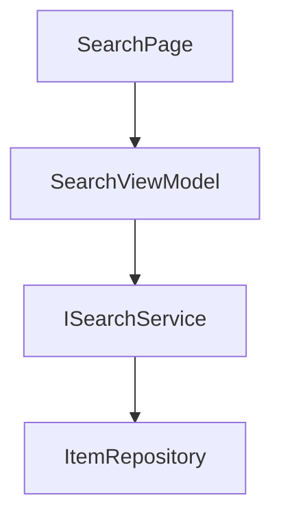

# Lean-Spec Template Refactoring Summary

> **Date**: 2025-12-29
> **Purpose**: Align lean-spec templates with Test-Driven Development (TDD) and Red-Green-Refactor (RGR) methodology for AI-driven development

---

## What Changed?

The lean-spec templates have been refactored to optimize for **AI agent-driven development** using strict TDD practices. The goal is to eliminate "vibe coding" (hallucinated features) and enforce a disciplined, test-first workflow.

### Before: Narrative Specs (Human-Oriented)

**Problem**: Traditional specs assume human developers can "read between the lines" and make reasonable assumptions. AI agents take instructions literally and often:

- Add features not explicitly defined
- Implement "Big Bang" code without tests
- Mix concerns across multiple phases
- Suffer from context drift in long conversations

### After: Blueprint Specs (AI-Optimized)

**Solution**: Refactored specs provide explicit instructions, hard boundaries, and phase-gated workflows:

- **Goals & Non-Goals**: Prevent scope creep
- **Mermaid Diagrams**: Visualize architecture before coding
- **Interface Signatures**: Define types upfront (compiler-driven)
- **Plain English Scenarios**: Convert directly to test methods
- **Phase-Gated Execution**: Scaffold → Test → Implement → Refactor
- **Chat Session Management**: New window per phase to minimize drift

---

## Document-by-Document Changes

### 1. DESIGN.md (The Blueprint)

#### Added Sections

- **Goals & Non-Goals**: Explicit boundaries (what NOT to build)
- **Visual Architecture**: Mermaid diagrams for component hierarchy
- **Interface & Method Signatures**: Define ALL public APIs with type signatures
- **Plain English Test Scenarios**: Given-When-Then scenarios that become tests
- **Platform-Specific Constraints**: MAUI-specific platform differences

#### Changed Sections

- **Technical Approach**: Now includes specific framework versions and patterns
- **Design Decisions**: Added "Trade-offs" subsection for each decision
- **Dependencies**: Split into System, Project, and External dependencies

#### Example

**Before**:

```markdown
## Architecture
<!-- High-level system design -->
```

**After**:

```markdown
## Goals & Non-Goals

### Goals
- ✅ Implement pagination (20 items per page)

### Non-Goals
- ❌ Infinite scroll (use pagination only)

## Interface & Method Signatures

```csharp
public interface IExampleService
{
    Task<IEnumerable<Item>> GetItemsAsync(int offset, int limit);
}
```

## Plain English Test Scenarios

### Scenario: Successful data load
- **Given**: Service returns 5 items
- **When**: ViewModel initializes
- **Then**: Items collection contains 5 elements
```

---

### 2. PLAN.md (The Assembly Sequence)

#### Complete Restructure

**Before**: Generic phase descriptions with tasks

**After**: Strict 4-phase TDD workflow with gated transitions

#### New Structure

1. **TDD Development Process**: Overview of RGR methodology
2. **Phase Transition Requirements**: Explicit gates (e.g., Phase 1 → 2 requires compilation)
3. **Phase 1: The Scaffold**: Empty classes only, `NotImplementedException`
4. **Phase 2: Narrow Test Definition**: Write failing tests (RED state)
5. **Phase 3: The TDD Loop**: Implement one test at a time (GREEN state)
6. **Phase 4: Integration & Refactoring**: Wire up DI, SOLID principles

#### Added AI Agent Directives

Each phase includes a copy-paste prompt for AI agents:

```markdown
**AI Agent Directive**:
> "Act as a C# scaffolding expert. Read DESIGN.md and create ONLY empty classes..."
```

#### Example

**Before**:

```markdown
### Phase 1: [Name]
**Goal**: <!-- What does this phase achieve? -->
**Tasks**: - [ ] Task 1
```

**After**:

```markdown
## Phase 1: The Scaffold

**Goal**: Create the structural skeleton WITHOUT any business logic.

**AI Agent Directive**:
> "Act as a C# scaffolding expert. Read DESIGN.md and create ONLY empty classes based on signatures. All methods must throw NotImplementedException. Mark classes with [Obsolete('Work in Progress')]. Your ONLY goal is a compiling project."

**Tasks**:
- [ ] Create all interfaces defined in DESIGN.md
- [ ] Create all ViewModel classes with constructor signatures only
- [ ] Verify project compiles: `dotnet build`

**Success Criteria**:
- [ ] Project builds successfully with zero errors
- [ ] All methods throw NotImplementedException
```

---

### 3. TEST.md (The Inspection Criteria)

#### Complete Restructure

**Before**: Generic test categories (unit, integration, performance)

**After**: Scenario-based test templates derived from DESIGN.md

#### New Structure

1. **Testing Strategy**: TDD focus with test pyramid
2. **Unit Tests (Red-Green-Refactor)**: Scenario-based test structure with TODO comments
3. **Integration Tests**: End-to-end flow validation
4. **Performance Tests**: Benchmark thresholds
5. **Security Tests**: Input validation examples
6. **Test Data**: TestDataBuilder pattern

#### Added Concrete Test Examples

Each scenario from DESIGN.md has a corresponding test template:

```csharp
// TODO: Implement test for "User submits empty form" scenario
// Given: The form is displayed
// When: User clicks "Submit" with an empty required field
// Then: An error message appears and form is not submitted

[Fact]
public void Should_Set_Error_Message_When_Submit_With_Empty_Field()
{
    // Arrange
    var mockService = new Mock<IExampleService>();
    var viewModel = new ExampleViewModel(mockService.Object);
    viewModel.SearchText = string.Empty;

    // Act
    viewModel.SubmitCommand.Execute().Subscribe();

    // Assert
    viewModel.ErrorMessage.Should().NotBeNullOrEmpty();
}
```

#### Example

**Before**:

```markdown
## Unit Tests
**Key test cases**:
- [ ] Test case 1
- [ ] Test case 2
```

**After**:

```markdown
## Unit Tests (Red-Green-Refactor)

### Test Naming Convention
Use LunaDraw standard: `Should_{Expected}_{When}_{Condition}`

### Scenario-Based Test Structure

#### Scenario: User submits empty form
[Complete test code example with Arrange-Act-Assert]

### Test Coverage Requirements
- ✅ Happy path
- ✅ Edge cases
- ✅ Error handling
- ✅ State transitions
```

---

### 4. README.md (The Route Map)

#### Added AI-Centric Sections

**Before**: Generic overview for human readers

**After**: Entry point for AI agents with explicit instructions

#### New Sections

1. **AI Development Flow (Route Map)**: Step-by-step guide for agents
2. **AI Agent Directive**: Copy-paste prompt for chat sessions
3. **Environment Specifications**: Exact frameworks, dependencies, build commands
4. **Project Context (for AI Agents)**: LunaDraw-specific patterns and coding standards

#### Example

**Before**:

```markdown
## Overview
<!-- What are we solving? -->

## Sub-Specs
- DESIGN.md
- PLAN.md
- TEST.md
```

**After**:

```markdown
## AI Development Flow (Route Map)

**CRITICAL**: This spec follows TDD with Red-Green-Refactor methodology.

### 📋 Entry Point for AI Agents

Before starting implementation, AI agents MUST:

1. **Read in order**:
   - ✅ README.md (context)
   - ✅ DESIGN.md (architecture)
   - ✅ PLAN.md (phases)
   - ✅ TEST.md (test templates)

2. **Execute phases sequentially**:
   - Phase 1: Scaffold
   - Phase 2: Test Definition
   - Phase 3: TDD Loop
   - Phase 4: Integration

3. **Use NEW chat window for EACH phase**

### 🎯 AI Agent Directive (Copy to Chat)

```
Act as a TDD expert working on the LunaDraw .NET MAUI project.

ENVIRONMENT:
- Framework: .NET 10, MAUI
- Testing: xUnit + Moq + FluentAssertions

INSTRUCTIONS:
1. Do NOT perform "Big Bang" implementations
2. Read DESIGN.md and PLAN.md BEFORE writing code
3. Follow ONLY the current phase in PLAN.md
...

Current Phase: [Specify Phase 1, 2, 3, or 4]
```
```

---

## New Documents Created

### 5. TDD-WORKFLOW-GUIDE.md

**Purpose**: Comprehensive guide explaining the refactored workflow

**Contents**:

- Overview of TDD philosophy
- Document structure breakdown
- Four-phase workflow walkthrough
- Chat session management strategy
- Anti-patterns to avoid (e.g., "vibe coding")
- Complete example walkthrough (Search feature)

---

## Key Improvements

### 1. Prevents "Vibe Coding"

**Before**: AI adds features not explicitly defined

```csharp
// ❌ AI hallucinated pagination when only search was specified
public async Task<PagedResult<Item>> SearchAsync(string query, int page, int pageSize)
```

**After**: Non-Goals section prevents scope creep

```markdown
### Non-Goals
- ❌ Pagination (implement in future spec)
```

---

### 2. Enforces Test-First Development

**Before**: AI writes code first, then adds tests

**After**: Phase 2 (Test Definition) MUST complete before Phase 3 (Implementation)

```
Phase 2 → Phase 3 Gate: At least one failing test must exist (RED state)
```

---

### 3. Compiler-Driven Self-Correction

**Before**: AI guesses types and parameters

**After**: Interface signatures defined upfront in DESIGN.md

```csharp
// Defined in DESIGN.md before any code is written
public interface ISearchService
{
    Task<IEnumerable<Item>> SearchAsync(string query);
}
```

---

### 4. Atomic Progress Tracking

**Before**: Unclear when a phase is "done"

**After**: Explicit success criteria for each phase

```markdown
**Success Criteria**:
- [ ] All tests FAIL (RED state)
- [ ] No implementation code written yet
```

---

### 5. Context Drift Prevention

**Before**: Single long conversation loses coherence

**After**: NEW chat window per phase with linked sessions

```markdown
## Notes
### Context Links
- Phase 1 Chat: [URL]
- Phase 2 Chat: [URL]
```

---

## How to Use the Refactored Templates

### Step 1: Create a New Spec

```bash
lean-spec create "feature-name"
```

This generates:

```
specs/NNN-feature-name/
├── README.md      # Route map for AI agents
├── DESIGN.md      # Architectural blueprint
├── PLAN.md        # Phase-by-phase plan
└── TEST.md        # Test templates
```

---

### Step 2: Fill Out DESIGN.md

1. Define **Goals & Non-Goals** (explicit boundaries)
2. Create **Mermaid diagram** (component hierarchy)
3. Define **Interface Signatures** (all public APIs)
4. Write **Plain English Test Scenarios** (Given-When-Then)
5. Document **Technical Approach** (frameworks, patterns)

---

### Step 3: Execute Phases (One Chat Per Phase)

#### Phase 1: Scaffold

**Open Chat → Paste AI Agent Directive from README.md**

```
Current Phase: Phase 1 (Scaffold)

Read DESIGN.md and create empty classes.
All methods throw NotImplementedException.
Verify: dotnet build
```

**Exit Criteria**: ✅ Project compiles

---

#### Phase 2: Test Definition

**Open NEW Chat → Paste AI Agent Directive**

```
Current Phase: Phase 2 (Test Definition)
Previous Phase: [Link to Phase 1 chat]

Read DESIGN.md scenarios.
Create xUnit tests for each scenario.
Do NOT implement code to make tests pass.
Verify: dotnet test (expect failures)
```

**Exit Criteria**: ✅ All tests FAIL (RED)

---

#### Phase 3: TDD Loop

**Open NEW Chat → Paste AI Agent Directive**

```
Current Phase: Phase 3 (TDD Loop - Test 1)
Previous Phase: [Link to Phase 2 chat]

Implement MINIMAL code to pass the FIRST failing test ONLY.
Wait for confirmation before proceeding to next test.
```

**Repeat** for each test:

1. RED: Identify failing test
2. GREEN: Implement minimal code
3. REFACTOR: Clean up
4. COMMIT: `git commit -m "test: pass TestName"`

**Exit Criteria**: ✅ All tests PASS (GREEN)

---

#### Phase 4: Integration & Refactoring

**Open NEW Chat → Paste AI Agent Directive**

```
Current Phase: Phase 4 (Integration)
Previous Phase: [Link to Phase 3 chat]

Review code for SOLID violations.
Register services in MauiProgram.cs.
Add integration tests.
Remove [Obsolete] attributes.
```

**Exit Criteria**: ✅ Production-ready code

---

## Migration Guide (Existing Specs)

If you have existing lean-spec documents, here's how to migrate them:

### 1. Backup Existing Specs

```bash
cp -r specs/ specs-backup/
```

### 2. Update DESIGN.md

Add these sections:

- `## Goals & Non-Goals`
- `## Visual Architecture` (Mermaid diagram)
- `## Interface & Method Signatures`
- `## Plain English Test Scenarios`

### 3. Restructure PLAN.md

Replace generic phases with:

- `## Phase 1: The Scaffold`
- `## Phase 2: Narrow Test Definition`
- `## Phase 3: The TDD Loop`
- `## Phase 4: Integration & Refactoring`

Add AI Agent Directives to each phase.

### 4. Expand TEST.md

Add scenario-based test templates with TODO comments.

### 5. Enhance README.md

Add:

- `## AI Development Flow (Route Map)`
- `## AI Agent Directive`
- `## Environment Specifications`
- `## Project Context (for AI Agents)`

---

## Benefits Summary

| Aspect | Before (Narrative) | After (Blueprint) |
|--------|-------------------|-------------------|
| **Scope Control** | Vague "high-level design" | Explicit Goals & Non-Goals |
| **Architecture** | Prose descriptions | Mermaid diagrams + signatures |
| **Test Strategy** | Generic test categories | Scenario-based test templates |
| **AI Guidance** | Implicit expectations | Explicit AI Agent Directives |
| **Phase Gating** | Unclear transitions | Explicit success criteria |
| **Context Management** | Single long conversation | New chat per phase |
| **Type Safety** | AI guesses types | Signatures defined upfront |
| **Progress Tracking** | Subjective completion | RED → GREEN → REFACTOR |

---

## Example Comparison

### Before: Generic Spec

```markdown
# DESIGN.md

## Architecture
The system will use MVVM pattern with ViewModels and Services.

## Technical Approach
We'll use .NET MAUI and ReactiveUI.
```

### After: Blueprint Spec

```markdown
# DESIGN.md

## Goals & Non-Goals

### Goals
- ✅ Implement search with 500ms debounce
- ✅ Display results in scrollable list

### Non-Goals
- ❌ Infinite scroll
- ❌ Advanced filtering

## Visual Architecture



## Interface & Method Signatures

```csharp
public interface ISearchService
{
    Task<IEnumerable<Item>> SearchAsync(string query);
}
```

## Plain English Test Scenarios

### Scenario: Search returns results
- **Given**: Service returns 3 items for "test"
- **When**: User types "test"
- **Then**: Results collection has 3 items
```

---

## FAQs

### Q: Do I need to use new chat windows for every phase?

**A**: Yes, this is critical to prevent context drift. AI agents lose coherence in long conversations.

---

### Q: Can I skip Phase 1 (Scaffold) and go straight to implementation?

**A**: No. The scaffold ensures all types are defined upfront, preventing compilation-driven hallucinations.

---

### Q: What if my feature is too simple for 4 phases?

**A**: You can combine Phase 1 and Phase 2 for trivial features, but NEVER skip test-first development (Phase 2 before Phase 3).

---

### Q: How do I link previous chat sessions?

**A**: Add a "Context Links" section in README.md Notes:

```markdown
### Context Links
- Phase 1 Chat: https://chatgpt.com/c/abc123
- Phase 2 Chat: https://chatgpt.com/c/def456
```

---

## Next Steps

1. **Review TDD-WORKFLOW-GUIDE.md** for detailed workflow explanation
2. **Create a test spec** using the new templates
3. **Practice the 4-phase workflow** with a simple feature
4. **Update existing specs** (optional) to use new format

---

## Feedback & Iteration

This refactoring is version 1.0. As you use these templates, please document:

- Bottlenecks or friction points
- Unclear instructions for AI agents
- Additional anti-patterns discovered
- Successful patterns to amplify

Update this document and TDD-WORKFLOW-GUIDE.md as you refine the process.

---

**Version**: 1.0
**Last Updated**: 2025-12-29
**Author**: AI-assisted refactoring based on TDD best practices
